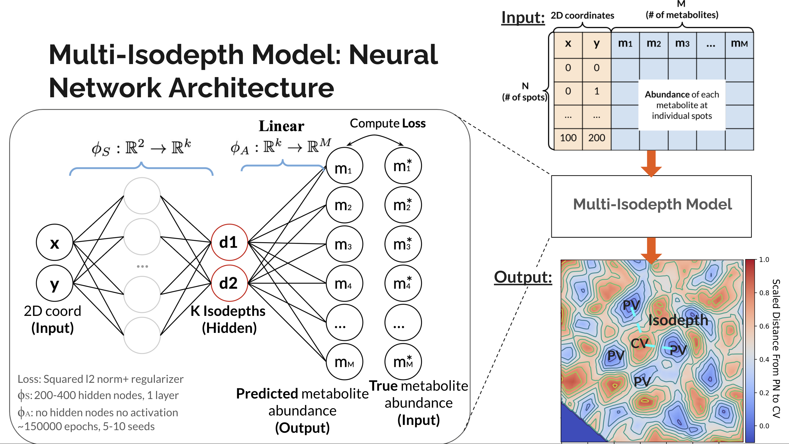

# Multi-GASTON

Multi-GASTON is an unsupervised deep learning model that learns multiple spatial gradients simoutaineously from spatially resolved data such as spatial metabolomics and spatially-resolved transcriptomics (SRT). It is an extension of GASTON (https://pmc.ncbi.nlm.nih.gov/articles/PMC10592770/), which was designed for SRT data and learns a single _topographic map_ of a 2-D tissue slice in terms of a 1-D coordinate called _isodepth_, where all genes can be expressed as a function of this isodepth. Now, allowing features like _metabolites_ or _genes_ to follow _mulitple distinct spatial patterns_, Multi-GASTON captures the feature topography by learning _k isodepths_, that smoothly vary across a tissue slice and capture spatial organizations of different groups of spatially variable features. 

<p align="center">

</p>

## Installation
First install the conda environment from the environment.yml file:
```
cd multi_gaston
conda env create -f environment.yml
```
Then, activate the enviroment and install multi_gaston
```
conda activate multi_gaston_env
pip install -e .
```
The installation should take less than 10 minutes.

## Tutorial
Example applications of Multi-Gaston to spatial metabolomics datasets of murine liver and small intestine can be found in https://github.com/raphael-group/MET-MAP, where the method is re-named as Metabolic Topography Mapper, MET-MAP.

## Software dependencies
* torch (=2.0.0)
* matplotlib (=3.8.0)
* pandas (=2.1.1)
* scikit-learn (=1.3.1)
* numpy (=1.23.4)
* jupyterlab (=4.0.6)
* seaborn (=0.12.2)
* tqdm (=4.66.1)
* scipy (=1.11.2)
* scanpy (=1.9.5)
* squidpy (=1.3.1)
