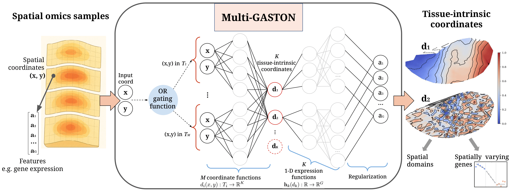

# Multi-GASTON
**A unified and interpretable deep learning framework for learning latent tissue geometry**

Multi-GASTON learns multiple spatial coordinates of variation shared across multiple spatially-resolved samples of the same tissue, such as spatial transcriptomics (ST) and spatial metabolomics. Specifically, Multi-GASTON models the latent geometry of a tissue using multiple **tissue-intrinsic coordinates**. It allows for the discovery of different subsets of features (e.g. genes, metabolites) that vary along specific spatial coordinates. 

### 🧬 Key Features
* **Piecewise Continuity:** Models feature expression as a function of tissue-intrinsic coordinates where pieces correspond to *spatial domains* and functions describe _continuous variation in expression_ within each domain along each spatial axis. 
* **No Alignment Required:** Multi-GASTON does **not** require samples to be physically aligned. It only requires samples to have the _same_ modality and underlying tissue structure.
* **Multi-Modal Support:** Applicable to Spatial Transcriptomics (ST), Spatial Metabolomics, and other spatially-resolved data.
  
<p align="center">

</p>

---

## 🚀 Installation
The installation process typically takes less than 10 minutes.
1. **Clone and Enter Repository:**
   ```bash
   git clone https://github.com/raphael-group/Multi-GASTON.git
   cd Multi-GASTON
2. Create Conda Environment:
    ```bash
    conda env create -f environment.yml
    ```
3. Activate and Install:
    ```bash
    conda activate multi_gaston_env
    pip install -e .
    ```

## 📖 Usage & Tutorials

### Main Multi-GASTON Demo
To get started with the current, multi-sample version of the framework, we provide a comprehensive tutorial in the `demo/` directory.
* **Dataset:** VisiumHD data of mouse small intestine.
* **Goal:** Demonstrating shared spatial axes across high-resolution spatial transcriptomics samples.

### Specialized Application: MET-MAP
While Multi-GASTON is the general-purpose framework, a preliminary version was applied to spatial metabolomics data in our *Nature* publication.

> [!NOTE]
> **MET-MAP (Metabolic Topography Mapper)**
> For users interested in reproducing the **single-sample analysis with linear feature functions** as applied to spatial metabolomics data, please refer to the [MET-MAP Repository](https://github.com/raphael-group/MET-MAP).
> 
> **Citation:** Samarah, L.Z., Zheng, C., Xing, X. et al. *Spatial metabolic gradients in the liver and small intestine.* **Nature** 648, 182–190 (2025). [https://doi.org/10.1038/s41586-025-09616-5](https://doi.org/10.1038/s41586-025-09616-5)

## 🛠 Software dependencies
* torch (=2.0.0)
* matplotlib (=3.8.0)
* pandas (=2.1.1)
* scikit-learn (=1.3.1)
* numpy (=1.23.4)
* jupyterlab (=4.0.6)
* seaborn (=0.12.2)
* tqdm (=4.66.1)
* scipy (=1.11.2)
* scanpy (=1.9.5)
* squidpy (=1.3.1)
